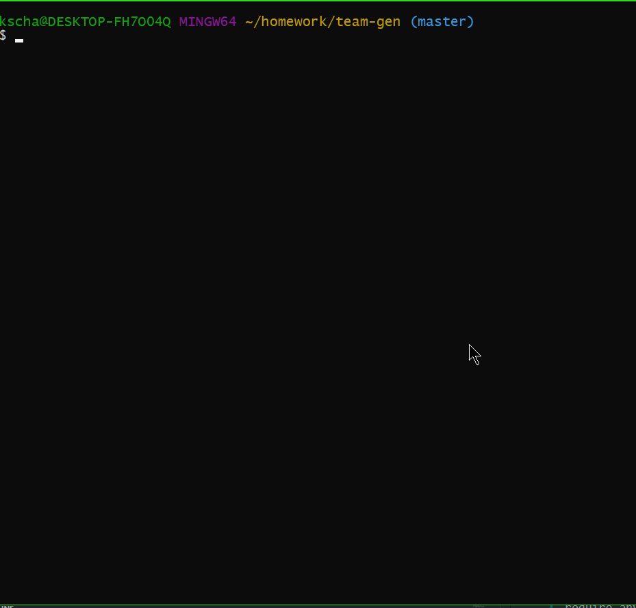

# Welcome to Team-Gen 👋

[](https://github.com/kschang77/team-gen/graphs/commit-activity)
[](https://github.com/kschang77/team-gen/blob/master/LICENSE)

> Team-Gen is a team webpage generator that realies heavily upon use of OOP and text template engine. Simply run it and follow prompts to add team members (3 classes: Manager, Engineer, Intern) and at the end, a _team.html_ will be generated based on the contents of the _templates_ directory and written to the _output_ subdirectory. 

### 🏠 [Homepage](https://github.com/kschang77/team-gen)

### ✨ Demo



## Requires
  * node.js
  * inquirer
  * path
  * fs
  * figlet
  * chalk
  * and eveyrthing else in ./lib
  * and everything else in ./templates

NOTE: While this program does not require anything else to run, the generated _team.html_ requires Bootstrap4. It has integral CDN references so it should work without further intervention, unless you don't have an Internet connection. 

## Usage

```sh
node team-gen
```

## Run tests

```sh
npm run test
```

NOTE: the tests are only on the base class and the three derivsed classes. They actually did not even check for proper inheritance. As they were a part of the requirements, no attempt was done to "enhance" them. Not does the main app have a matching test. Perhaps one can use **mock** to test the main app should one want to extend the tests to be more comprehensive. 

## Details

App uses a base class of employee (see _employee.js_) to create 3 derived classes, _manager.js_, _engineer.js_ and _intern.js_ with slightly different input fields. 

Each class has matching templates in the _templates_ subdirectory to control how its own block of HTML/Bootstrap4 code will look. This allows easy customization, should one wants to use different icons, formating, and so on. 

The app itself uses async/await techniques to call upon _inquirer_ to get the input from the user. 

Upon user choosing "Stop Entry", the _team.html_ is generated based on the various templates and written to the outputpath displayed (usually _./output_ ) using presupplied code _htmlrenderer_ which calls upon the files in _templates_ subdir. Right now, the templates uses Bootstrap4, but it can be changed easily. 

**Please note** that if _output_ subdirectory doesn't exist, it will be created. And if _team.html_ already exists in the outputpath, it will be **overwritten**. 


## Limitations

At this time, validation is rather minimal. There is no attempt to search for duplicates when entering new employee. Indeeed, the only validations done are 

### make sure Name, Github, and School are not blank

```        
        function validateNonBlank(name) {
          if (name === '') {
            return "This field cannot be blank!"
          } else {
            return true
          }
         }
```

### make sure employeeID, phone and room number are integers

```       
        function validateInt(name) {
          if (Number.isInteger(Number(name))) {
            return true
          } else {
            return "That is not an integer!"
          }
        }
   ```

### make sure email conforms to proper pattern (@,., etc.) 

```       
        function validateEmail(name) {
          if (/^\w+([\.-]?\w+)*@\w+([\.-]?\w+)*(\.\w{2,3})+$/.test(name)) {
            return (true)
          }
          return "Invalid email address!"
        }
 ```

NOTE: Credit to w3resources for the regex pattern and code for email validation. 

To minimize code duplication (DRY) the three functions were extracted and made separate so they can be reused instead of new anonymous functions decalred each time, that was in the old version. 

As this is meant to be "run once" app, there is no edit or delete function.  If you made a mistake, you need to either edit the outputfile directly, or run this app again to generate a new outputfile. 

It may be possible to write a more interactive interface to allow the user to preview the employee entered thus far, separated by type, edit/delete employees, before finally ending the app to generate the output. However, that is beyond the scope of this app. 


## Author

👤 **Kasey Chang**

* LinkedIn: [@kschang77](https://www.linkedin.com/in/kasey-chang-0932b332/)
* Github: [@kschang77](https://github.com/kschang77)


## 📝 License

Copyright © 2020 [Kasey Chang](https://github.com/kschang77).

This project is [MIT](https://github.com/kschang77/team-gen/blob/master/LICENSE) licensed.

***
_This README was generated with ❤️ by [readme-md-generator](https://github.com/kefranabg/readme-md-generator)_
